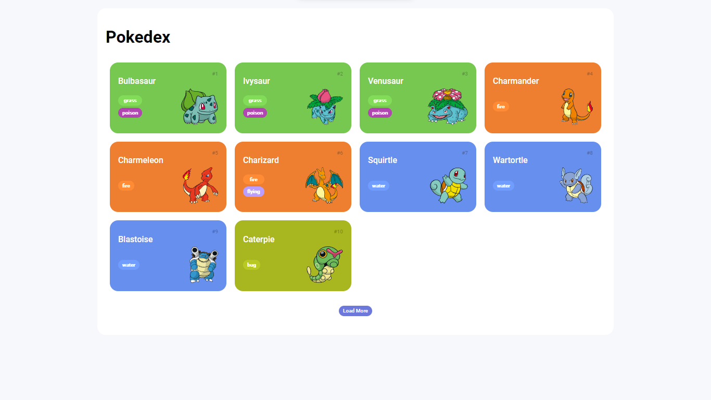
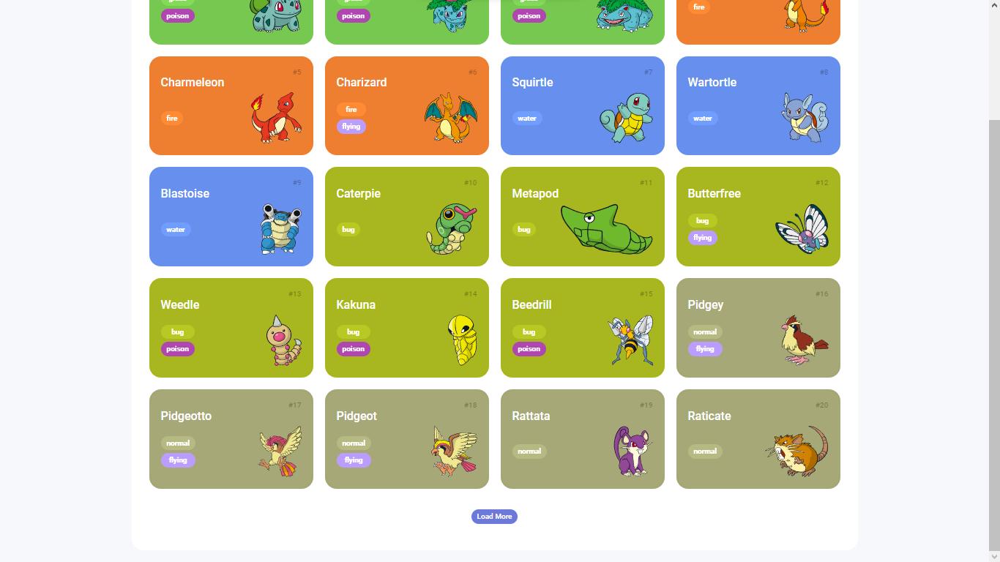

# DIO - Pokedex

### [Preview do Site ](https://renato-chaves.github.io/DIO-Pokedex/Pokedex/index.html)

Um site feito utilizando    para criar um agregador de informações sobre pokemons, inspirado em uma pokedex utilizando a PokeAPI como fonte de dados.

### Tela Inicial:
* Nessa pagina, utilizando dados recebidos através de uma conexão com a PokeAPI, é criado uma lista estilizada dos pokemons em tempo real limitada, para a visualização sem sobrecarregar o usuario.

* De inicio são apenas carregados 10 pokemons, porém, ao clicar no botão `Load More` o site irá consultar e adicionar 10 novos pokemons à lista.

